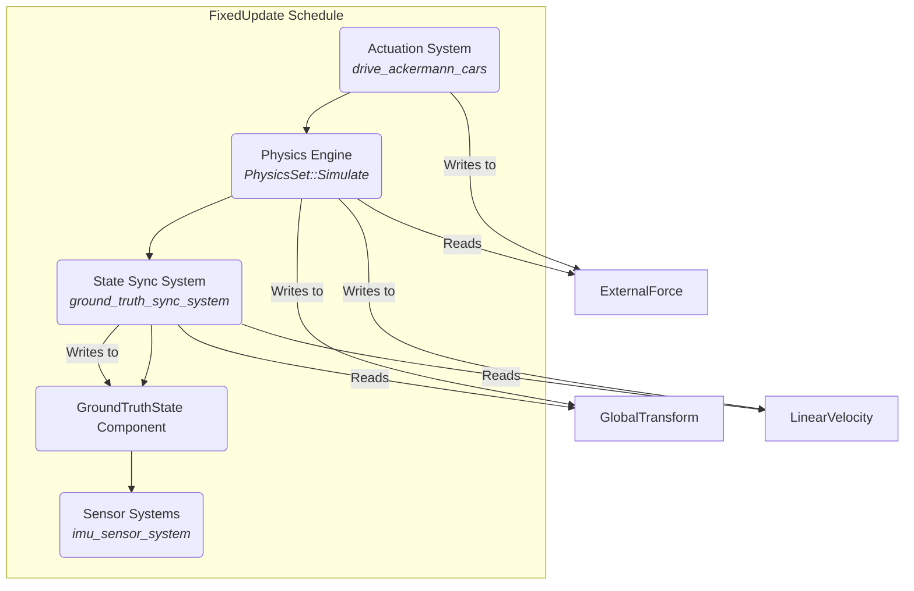

# System Design: Physics & Ground Truth

This document describes how Helios integrates with the `avian3d` physics engine to simulate rigid body dynamics and how it produces the authoritative `GroundTruthState` used by all other sensor and logic modules.

---

## 1. Core Principles

- **Source of Truth:** The `avian3d` physics engine is the ultimate source of truth for an agent's physical state (position, orientation, velocity).
- **Decoupling:** Our core simulation logic should not depend on `avian3d` specifics. The `GroundTruthState` component is the clean abstraction layer between the physics engine and the rest of the simulation.
- **Coordinate System Boundary:** All physics calculations are performed by Avian in Bevy's **Y-Up** coordinate system. The conversion to our robotics-standard **ENU (Z-Up)** frame happens in a single, dedicated system.

---

## 2. Physics Simulation with Avian3D

Helios uses the `PhysicsPlugins::default()` from `avian3d` to provide the core simulation capabilities.

### Key Avian Components Used:

- **`RigidBody::Dynamic`:** Marks an entity as a movable object.
- **`Collider`:** Defines the physical shape of an object for collision detection. We use primitive shapes like `Collider::cuboid()` and `Collider::cylinder()`. For complex world geometry, we will use `Collider::trimesh_from_mesh()`.
- **`Mass`:** Defines the mass of the object.
- **`ExternalForce` & `ExternalTorque`:** These are the primary inputs to the physics simulation. Our `Actuation` systems (like `drive_ackermann_cars`) write to these components to make the vehicle move. For Ackermann vehicles this is the output of a three-layer pipeline — see `docs/systems/ackermann_actuation.md`.
- **`LinearVelocity` & `AngularVelocity`:** These components are written to by the physics engine. We read from them to get the results of the simulation.
- **`Gravity`:** A Bevy `Resource` that defines the global gravity vector, which Avian automatically applies to all dynamic bodies.

### The Physics Step in the Schedule

The main physics calculation happens during the `PhysicsSet::Simulate` system set, which is part of Bevy's `FixedUpdate` schedule. Our entire `SimulationSet` chain is explicitly ordered around this critical step to ensure causality.

---

## 3. The Ground Truth Sync System

Because the physics engine's state is in a Bevy-specific format and coordinate system, we cannot use it directly. The `ground_truth_sync_system` is a critical bridge that runs in the `SimulationSet::StateSync`, immediately after `PhysicsSet::Simulate`.

**Its sole responsibility is to:**

1.  **Read** the final state from Avian's components (`GlobalTransform`, `LinearVelocity`, `AngularVelocity`) for the current frame.
2.  **Convert** this data into our robotics-standard ENU coordinate system.
3.  **Calculate** derived quantities, like coordinate acceleration.
4.  **Write** the final, clean data to the `GroundTruthState` component.

### Calculating Coordinate Acceleration

Directly querying acceleration from a physics engine is often difficult or unreliable. Instead, we use **finite differencing of velocity**, which is a robust and standard approach.

- **Formula:** `acceleration = (current_velocity - previous_velocity) / dt`
- **Implementation:**
  1.  The `GroundTruthState` component stores `last_linear_velocity` from the previous frame.
  2.  The `ground_truth_sync_system` reads the new `LinearVelocity` from Avian.
  3.  It calculates the acceleration using the formula above.
  4.  It updates `GroundTruthState` with the new acceleration and velocity, and critically, it updates `last_linear_velocity` to prepare for the _next_ frame's calculation.

This provides a stable and physically correct `linear_acceleration` value for our sensor models to use.

### Data Flow Diagram

---

## 4. Open Questions & Future Considerations

- **Friction & Contact Forces:** Our current method for calculating acceleration (`a = (v_new-v_old)/dt`) correctly captures the _net effect_ of all forces, including friction and ground contact. However, it doesn't allow us to inspect those forces individually. Future debugging may require deeper integration with Avian's APIs if they become available.
- **Complex Colliders:** For loading complex environments
