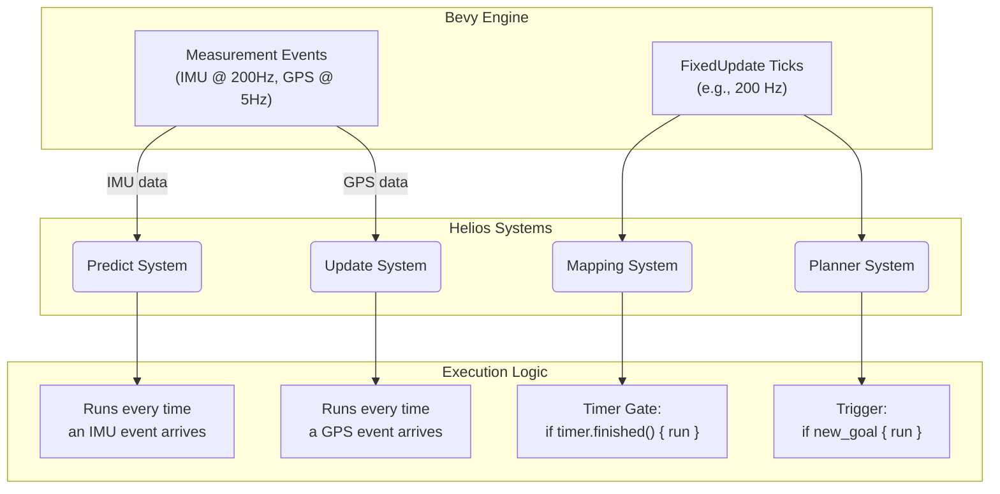

# System Design: The Core Simulation Engine

This document describes the foundational systems that manage the simulation's lifecycle, time, and execution order. These systems form the "operating system" upon which all other modules (Physics, Sensors, Autonomy) are built.

---

## 1. Core Principles

- **Determinism:** The engine must be capable of producing repeatable results from a given scenario file and seed.
- **Decoupling:** The core engine should not have knowledge of specific algorithms (e.g., EKF, A\*). It provides a structured environment for them to run in.
- **Causality:** The execution order must guarantee a logical flow of data (e.g., physics is always simulated before sensors read the new state).

---

## 2. App State Management

The simulation's lifecycle is managed by a state machine, defined by the `AppState` enum. This ensures that systems only run when they are supposed to.

### States

- `AppState::Loading`: The initial state. The application is loading assets and parsing configuration. No simulation logic runs.
- `AppState::SceneBuilding`: A transient state entered after loading. This is where all spawner systems run to build the Bevy ECS `World` from the scenario configuration. This state runs for only a single frame.
- `AppState::Running`: The main simulation loop. All `FixedUpdate` and `Update` systems for physics, sensors, and autonomy execute in this state.
- `AppState::Paused`: (Future) The simulation loop is halted, but the rendering and UI can continue.
- `AppState::Finished`: The simulation has completed its configured duration or met an end condition.

### State Transitions

The flow is strictly linear: `Loading` -> `SceneBuilding` -> `Running` -> `Finished`. The transition from `SceneBuilding` to `Running` is handled by a dedicated system (`transition_to_running_state`) that runs at the end of the `OnEnter(SceneBuilding)` schedule.

---

## 3. Time Management

To ensure determinism and support high-frequency control loops, Helios relies on Bevy's **`FixedUpdate`** schedule for all core logic.

### Fixed Timestep

- **Mechanism:** We use Bevy's `Time<Fixed>` resource to drive the simulation clock.
- **Configuration:** The simulation frequency (e.g., 200 Hz) can be set in the main application entry point (`main.rs`) by inserting a configured `Time<Fixed>` resource.
- **Rule:** All systems that affect the physical state or algorithmic output of the simulation **must** be placed in the `FixedUpdate` schedule.
- **Variable Timestep (`Update`):** The `Update` schedule, which is tied to the rendering frame rate, is used **only** for non-deterministic tasks like user input (keyboard control) and debug visualizations (gizmos).

### Deterministic Randomness

- **Mechanism:** A single, seeded Pseudo-Random Number Generator (PRNG) is created at startup and stored in the `SimulationRng` resource.
- **Rule:** Any system that requires random numbers (e.g., sensor noise models) **must** take `ResMut<SimulationRng>` as a parameter and use this shared instance. Using thread-local or OS-level RNGs is forbidden in simulation logic to preserve determinism.

---

## 4. System Scheduling & Execution Order

A correct, causal execution order is the most critical guarantee provided by the core engine. This is enforced using explicitly chained `SystemSet`s within the `FixedUpdate` schedule.

### Spawning Pipeline (`OnEnter(SceneBuilding)`)

The `SceneBuildSet` enum defines a strict, chained order for entity creation to manage dependencies correctly.

1.  **CreateRequests:** Spawn empty agent entities with a `SpawnAgentConfigRequest`.
2.  **ProcessVehicle:** Add vehicle-specific components (e.g., `AckermannParameters`).
3.  **ProcessSensors:** Spawn sensor entities as children and attach their models.
4.  **ProcessBaseAutonomy:** Add core autonomy components (`EstimatorComponent`, `MapperComponent`) that depend on the vehicle and sensors.
5.  ... (Other steps)
6.  **Finalize:** Run final setup systems (e.g., `build_static_tf_maps`) after all entities exist.
7.  **Cleanup:** Remove temporary request components.

### Runtime Pipeline (`FixedUpdate`)

The `SimulationSet` enum defines the main data flow loop for each timestep.

1.  **`Precomputation`:** Prepare data for the frame (e.g., rebuild the `TfTree`).
2.  **`Sensors`:** Raw sensor simulation: IMU noise, GPS lever arm, LiDAR raycasting. Emits `BevyMeasurementMessage`.
3.  **`Perception`:** Sensor data processing (detections, segmentation).
4.  **`WorldModeling`:** SLAM, mapping, tracking.
5.  **`Estimation`:** EKF/UKF predict+update via `EstimationPlugin`. Reads `BevyMeasurementMessage`, publishes `Odometry`.
6.  **`Behavior`:** Behavior trees / high-level decision making.
7.  **`Planning`:** Path planning (A\*, RRT\*).
8.  **`Control`:** Motion control (PID, MPC). Reads estimated state and planned path.
9.  **`Actuation`:** Apply forces/torques to the physics bodies.
10. **`PhysicsSet::Simulate` (Avian3D):** The physics engine runs, calculating the new state.
11. **`StateSync`:** The `ground_truth_sync_system` reads the new physics state and updates the `GroundTruthState` component.
12. **`Validation`:** Ground truth is published to `TopicBus`; `update_path_trail` appends the latest position to each agent's trail buffer.

This explicit ordering ensures a logical, causal flow of information through the entire simulation.

---

## 5. Multi-Rate Execution in a Fixed Timestep

A common requirement in robotics is to run different processes at different frequencies. For example:

- **Estimator Predict Step:** Runs at a high frequency (e.g., 200 Hz), driven by the IMU.
- **GPS Update Step:** Runs at a low frequency (e.g., 5 Hz).
- **Mapping:** Runs at a very low frequency (e.g., 1 Hz) due to its computational cost.

Helios achieves this multi-rate behavior _within_ a single, high-frequency `FixedUpdate` schedule using two primary techniques: **Event-Driven Systems** and **Timer-Gated Systems**.

### A. High-Frequency, Event-Driven Systems

This pattern is used for processes that must react immediately to incoming data, like the estimator's `predict` step.

- **Mechanism:** Instead of running on a clock, these systems are driven by the arrival of Bevy `Events`.
- **Example (`run_estimation`):**
  1.  The `ImuPlugin` runs in the `Sensors` set and publishes a `BevyMeasurementMessage` at 200 Hz.
  2.  The `run_estimation` system runs in the `Estimation` set and has a run condition: `.run_if(on_event::<BevyMeasurementMessage>())`.
  3.  **Result:** This system only consumes CPU cycles when there are new IMU messages to process. It naturally runs at the same rate as the sensor that drives it. If you have two IMUs publishing at 200 Hz each, this system will run 400 times per second.

### B. Low-Frequency, Timer-Gated Systems

This pattern is used for slow, periodic tasks like mapping or SLAM optimization.

- **Mechanism:** The system itself still runs on every `FixedUpdate` tick (e.g., at 200 Hz), but the _expensive logic_ inside it is wrapped in a "gate" controlled by a `bevy::prelude::Timer`.
- **Example (mapping system):**
  1.  At startup, the spawning system reads the mapper's configured rate (e.g., 1 Hz) and adds a `ModuleTimer(Timer::from_seconds(1.0, ...))` component to the agent.
  2.  On every `FixedUpdate` tick, the mapping system runs.
  3.  The first thing it does is `timer.tick(time.delta())`. This is a very cheap operation.
  4.  It then checks `if !timer.just_finished() { return; }`.
  5.  **Result:** For 199 out of 200 ticks, the system does almost nothing and returns immediately. On the 200th tick, `timer.just_finished()` is true, and the system proceeds to execute its expensive mapping logic.

### Data Flow Diagram

### Summary of Benefits

This hybrid approach provides the best of all worlds:

- **High-Frequency Reactivity:** Event-driven systems provide the lowest possible latency for critical tasks like IMU integration.
- **Predictable Low-Frequency Tasks:** Timer-gated systems ensure that expensive processes like mapping run at a consistent, controllable rate without consuming unnecessary CPU on every tick.
- **Overall Simplicity:** Both patterns live within the same `FixedUpdate` (or `Update`) schedule, making the overall application structure simple and easy to reason about.
