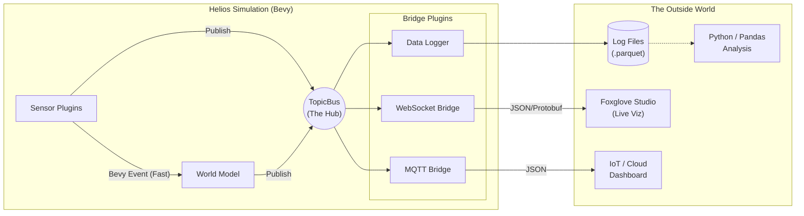

# System Design: The TopicBus (External Messaging & Data Logging)

The **TopicBus** is the Helios simulation's gateway to the outside world.

While the simulation internals run on high-speed, direct memory access (Bevy Events), the TopicBus provides a structured, publish-subscribe interface designed for **observation, data logging, and external connectivity**.

---

## 1. Core Concept: Internal vs. External

Helios uses a **Dual-Path Architecture** to balance performance with connectivity.

| Feature         | Internal Path (Bevy Events)                       | External Path (TopicBus)                             |
| :-------------- | :------------------------------------------------ | :--------------------------------------------------- |
| **Purpose**     | Real-time control loop (Sensor -> EKF -> Control) | Telemetry, Dashboards, Data Recording, ROS2 Bridge   |
| **Speed**       | 1000+ Hz (Physics/Sim Rate)                       | 1-60 Hz (Network/Disk Rate)                          |
| **Data Format** | Rust Structs (Zero-copy pointers)                 | Serialized (JSON, Bincode, Protobuf)                 |
| **Consumer**    | Core Algorithms (`helios_core`)                   | External Tools (Foxglove, Python scripts, Log files) |

**Key Benefit:** Your simulation physics never lags just because the Wi-Fi connection to your dashboard is slow.



---

## 2. Topic Naming Standard

Topics use a hierarchical, slash-separated naming scheme similar to ROS or MQTT.

`/{agent_name}/{category}/{stream}`

**Examples:**

- `/RoboCar-01/sensors/primary_imu`
- `/RoboCar-01/sensors/roof_lidar/scan`
- `/RoboCar-01/state/ground_truth`
- `/RoboCar-01/odometry/estimated`
- `/global/map`

---

## 3. Architecture

### A. The Topic Registry

A central Bevy `Resource` that maintains the list of active topics and their configuration.

```rust
struct TopicRegistry {
    topics: HashMap<String, TopicMetadata>,
}
```

### B. The Publisher

Systems in `helios_sim` (like Sensor Plugins) publish data to the bus.

- For **lightweight data** (IMU, GPS): Data is cloned.
- For **heavyweight data** (Images, PointClouds): Data is wrapped in an `Arc<T>` (Atomic Reference Counted pointer). This ensures the massive data blob is stored in memory only once, even if multiple bridges read it.

### C. The Bridge Plugins (Consumers)

The TopicBus does not store data; it routes it to **Bridge Plugins**. These are modular adapters that send data to specific destinations.

**Supported / Planned Bridges:**

1.  **`DataLoggerPlugin`:**
    - **Function:** Writes topic data to disk for offline replay and analysis.
    - **Format:** Parquet (columnar, efficient) or MCAP (robotics standard).
    - **Use Case:** Training ML models, post-run error analysis.

2.  **`WebSocketBridgePlugin` (e.g., for Foxglove):**
    - **Function:** Streams live data to a web browser.
    - **Format:** JSON or Protobuf over WebSocket.
    - **Use Case:** Real-time visualization using tools like Foxglove Studio.

3.  **`MQTTBridgePlugin`:**
    - **Function:** Publishes data to an MQTT broker (e.g., Mosquitto).
    - **Format:** JSON or Binary.
    - **Use Case:** IoT dashboards, multi-robot coordination, remote monitoring over the internet.

4.  **`ROS2BridgePlugin`:**
    - **Function:** Publishes data as standard ROS2 messages.
    - **Use Case:** Interfacing with existing robotics stacks (Navigation2, MoveIt).

---

## 4. Configuration

The TopicBus is configured via the `scenario.toml`.

```toml
[simulation.telemetry]
# Global settings
publish_rate_limit = 60.0 # Max Hz for external publishing

[simulation.bridges.mqtt]
enabled = true
broker_url = "mqtt://localhost:1883"

[simulation.bridges.logging]
enabled = true
output_dir = "logs/"
format = "parquet"
topics = ["/RoboCar-01/odometry/estimated", "/RoboCar-01/sensors/*"]
```

## 5. How to Add a New Topic

1.  **Define the Data Struct:** Ensure your data struct in `helios_core/src/messages.rs` implements `Serialize` and `Deserialize`.
2.  **Publish in System:**
    ```rust
    fn my_sensor_system(mut topic_bus: ResMut<TopicBus>, ...) {
        // ... generate data ...
        topic_bus.publish("/MyAgent/sensors/my_sensor", data);
    }
    ```
3.  **That's it.** The active Bridge Plugins will automatically pick up the new topic and route it.

```

```
