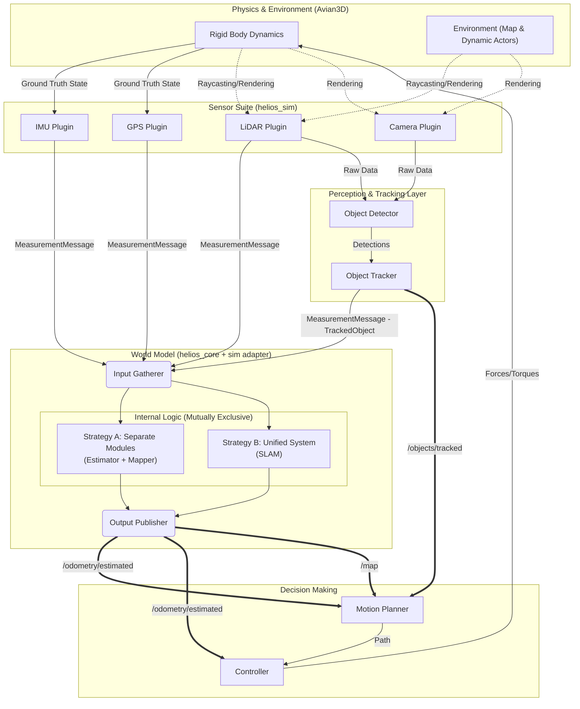

# Helios Architecture

This document describes the high-level design, data flow, and structural philosophy of the Helios robotics simulation platform.

## 1. High-Level Concept

Helios is a modular, data-driven simulation platform designed to bridge the gap between high-fidelity physics simulation and autonomous robotics algorithms.

It treats the simulation loop as a closed feedback system:

1.  **Sense:** Physics simulation generates raw sensor data.
2.  **Think:** Algorithms fuse data, build maps, and plan paths.
3.  **Act:** Controllers generate forces/torques to drive the physics engine.

### System Diagram

---

## 2. Project Structure: Core vs. Sim

The project is split into two distinct crates to enforce a strict separation between **logic** and **implementation**.

### `helios_core` (The Algorithm Toolbox)

- **Role:** Contains pure, framework-agnostic robotics algorithms and math.
- **Dependencies:** Minimal (e.g., `nalgebra`). It **does not** depend on Bevy.
- **Contents:**
  - **Traits:** `StateEstimator`, `Mapper`, `SlamSystem`, `Dynamics`, `Measurement`.
  - **Models:** Concrete implementations of physics models (`IntegratedImuModel`) and sensor models (`GpsModel`).
  - **Data Structures:** Standardized messages like `MeasurementMessage`, `Odometry`, and `PointCloud`.
- **Philosophy:** This code could theoretically run on a real robot.

### `helios_sim` (The Simulation Engine)

- **Role:** The host application that runs the simulation loop, visualization, and physics.
- **Dependencies:** `bevy`, `avian3d`, `helios_core`.
- **Contents:**
  - **Plugins:** Bevy plugins for Sensors, World Modeling, Planning, and Control.
  - **Systems:** ECS systems that orchestrate data flow (e.g., `raycasting_sensor_system`, `world_model_processor`).
  - **Adapters:** Code that translates Bevy types (Transforms) into Core types (Isometries).

---

## 3. The Data Pipeline

Data flows through the system in a strictly ordered pipeline, managed by Bevy's `FixedUpdate` schedule.

### Stage 1: Physics & Ground Truth

- **Engine:** `Avian3D` calculates rigid body dynamics.
- **Sync:** A `StateSync` system reads the final physics state (Pose, Velocity) and converts it to the standardized ENU coordinate frame, storing it in a `GroundTruthState` component.

### Stage 2: Sensing & Perception

- **Producers:** Sensor plugins (`ImuPlugin`, `GpsPlugin`) read the `GroundTruthState`.
- **Raycasting:** The `RaycastingSensorPlugin` performs physics queries for LiDAR/Radar.
- **Output:** All sensors publish standardized `BevyMeasurementMessage` events containing pure `helios_core` data structs.

### Stage 3: The World Model (Estimation & Mapping)

- **Role:** The central "brain" that fuses sensor data.
- **Configuration:** Configured via `scenario.toml` to run in one of two modes:
  - **Separate:** Runs an `Estimator` (EKF/UKF) and a `Mapper` (Occupancy Grid) independently.
  - **Combined:** Runs a `SLAM` system (Factor Graph) that handles both.
- **Orchestration:**
  - An **Event-Driven Processor** runs the high-frequency estimator (e.g., INS filter) as fast as data arrives.
  - A **Fixed-Rate System** runs the computationally expensive Mapper or SLAM optimizer at a lower, user-defined rate (e.g., 5Hz).
- **Output:** Publishes `/odometry/estimated` and `/map` topics.

### Stage 4: Decision Making (Planning & Control)

- **Planner:** Consumes `/map` and `/odometry/estimated` to generate a `/path/desired`.
- **Controller:** Consumes `/path/desired` and `/odometry/estimated` to calculate control inputs (Throttle, Steering).
- **Actuation:** The final system applies these controls as forces/torques to the physics engine, closing the loop.

---

## 4. Key Architectural Patterns

### The "Trait Object" Pattern

We use Rust traits (`Box<dyn Trait>`) to decouple the simulator from specific algorithms.

- The `WorldModelPlugin` does not know it is running an "EKF." It only knows it holds a `Box<dyn StateEstimator>`.
- This allows us to swap algorithms (e.g., switch from EKF to Particle Filter) just by changing a line in the configuration file.

### The "Configuration-Driven" Pattern

- **Source of Truth:** The `scenario.toml` file defines the entire simulation.
- **Spawners:** Bevy systems read this config at startup to compose the entity's components.
- **No Hard-Coding:** Noise levels, update rates, and model choices are always injected from the config.

### The "Coordinate Frame" Boundary

- **Bevy Side:** Uses Left-Handed Y-Up (Graphics standard).
- **Core Side:** Uses Right-Handed Z-Up (Robotics standard: ENU/FLU).
- **The Wall:** We enforce a strict boundary. All data crossing from `sim` to `core` is converted to ENU. All data crossing back for visualization is converted to Bevy-frame.
