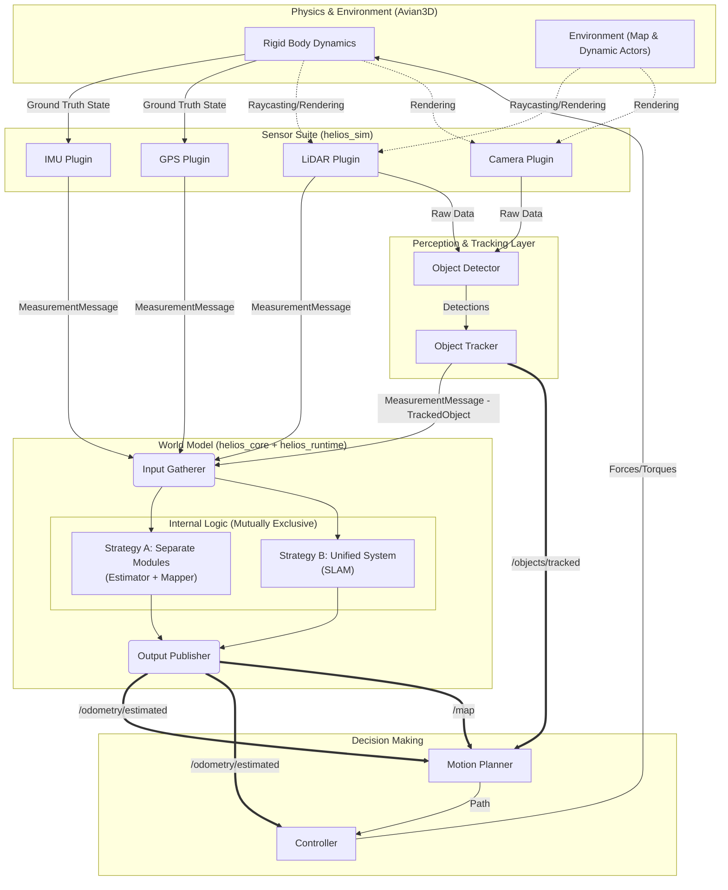

# Helios Architecture Review

> Comprehensive systems-level analysis of the Helios robotics simulation platform.
> Covers structural weaknesses, scalability risks, ECS anti-patterns, recommended
> improvements, and a next-generation architecture for multi-host deployment
> (simulation, hardware, HIL, digital twin).

---

## Table of Contents

1. [System Overview](#system-overview)
2. [Structural Weaknesses](#structural-weaknesses)
3. [ECS Anti-Patterns and Issues](#ecs-anti-patterns-and-issues)
4. [Scalability Risks](#scalability-risks)
5. [Module Boundary Problems](#module-boundary-problems)
6. [Missing Abstractions](#missing-abstractions)
7. [Recommended Improvements](#recommended-improvements)
8. [Next-Generation Architecture](#next-generation-architecture)
9. [Next Steps — Phased Roadmap](#next-steps--phased-roadmap)
10. [Long-Term Vision](#long-term-vision)

---

## System Overview

Helios is a modular robotics/autonomy simulation platform built in Rust. It is
split into three crates with a strict one-way dependency chain:

```
helios_core      (pure algorithms, no framework deps)
     ^
     |
helios_runtime   (autonomy pipeline orchestration, Bevy-free)
     ^
     |
helios_sim       (Bevy 0.16+ / Avian3D simulation host)
```

### Data Flow Diagram



### helios_core

- Pure algorithmic library: EKF, UKF, PID, LQR, dynamics models, sensor models,
  mapping, SLAM trait stubs.
- Framework-agnostic. Could deploy to real hardware.
- Coordinate conventions: ENU world, FLU body. All values SI, f64.
- Key traits: `StateEstimator`, `EstimationDynamics`, `Measurement`, `Controller`,
  `Mapper`, `SlamSystem`.
- `FrameAwareState` provides a layout-indexed state vector with covariance.

### helios_sim

- Bevy ECS host wrapping core algorithms in components and systems.
- Avian3D rigid-body physics.
- TOML-driven configuration with a catalog/prefab resolution system.
- `AutonomyRegistry` maps config string keys to factory closures — spawning
  systems never name concrete algorithm types.
- `TopicBus` provides a generic pub/sub message bus.
- `TfTree` maintains a transform graph bridging Bevy transforms to ENU/FLU.
- Phased spawn pipeline (`SceneBuildSet`, 10 ordered phases) and a runtime
  data-flow schedule (`SimulationSet`, 7 ordered phases plus physics).

### Current Scale

- ~10,900 lines of Rust across both crates.
- 1 vehicle type (Ackermann), 4 sensor types (IMU, GPS, magnetometer, 2D LiDAR).
- 2 filter implementations (EKF, UKF), 3 controller types (PID, LQR, Feedforward PID).
- 1 mapper (occupancy grid), SLAM trait defined but no concrete implementation.
- Foxglove WebSocket bridge for scalar telemetry.

---

## Structural Weaknesses

### SW-1: TopicBus serializes all parallel systems ✅ FIXED (Phase 5)

All four sensor systems (`imu`, `gps`, `magnetometer`, `raycasting`) no longer take
`ResMut<TopicBus>`. The hot path now has zero `TopicBus` writes. All TopicBus writes
are isolated to `SimulationSet::Validation` via two cold-path systems:
`sensor_telemetry_system` and `autonomy_telemetry_system`. The remaining `Validation`
writers (`ground_truth_publish_system`, `tf_publish_system`) are inherently sequential
and contend only with each other — never with hot-path estimation or sensor systems.

### SW-2: Dual messaging path — TopicBus AND Bevy Events ✅ FIXED (Phase 5)

Sensor systems now emit **only** `BevyMeasurementMessage` events.
`route_sensor_messages` routes those events into per-agent `SensorMailbox` components.
`sensor_telemetry_system` in `Validation` reads from `SensorMailbox` and publishes to
`TopicBus`. There is exactly one source of truth. A new sensor needs only to emit an
event — the cold-path publish is automatic via `SensorTopicName`.

### SW-3: SpawnAgentConfigRequest is a god component

`SpawnAgentConfigRequest(pub AgentConfig)` carries the entire agent config —
vehicle params, all sensors, full autonomy stack, poses — as one component.
Every spawn phase queries the same monolithic blob.

- No compile-time visibility into which phase consumed which data.
- `AgentConfig` is deep-cloned into every build context.
- After `cleanup_spawn_requests` removes it, nothing enforces that no system
  reads it afterward.

### SW-4: WorldModelComponent enum forces exhaustive matching ✅ FIXED (Phase 2+3+5)

Phase 2 replaced the enum with `AutonomyPipelineComponent(pub AutonomyPipeline)`.
Phase 3 renamed it and its directory. Phase 5 decomposed it further into three
independent ECS components — no enum, no match arms anywhere:

```rust
// plugins/autonomy/components.rs
#[derive(Component)] pub struct EstimatorComponent(pub EstimationCore);
#[derive(Component)] pub struct MapperComponent(pub MappingCore);
#[derive(Component)] pub struct ControlPipelineComponent(pub ControlCore);
```

Systems query only the component they need. Adding a mapper-only agent requires
zero changes to the estimation or control systems.

### SW-5: Manual axis swaps outside transforms.rs ✅ FIXED (Phase 1)

`ground_truth_sync_system` now uses `bevy_vector_to_enu_vector()` for both
`linear_velocity` and `angular_velocity`. No manual axis arithmetic outside
`transforms.rs`.

### SW-6: `.unwrap()` in EKF runtime code path ✅ FIXED (Phase 1)

The EKF update path now uses `if let Some(tf) = context.tf` guards.
A missing TF provider skips the update gracefully instead of crashing.

---

## ECS Anti-Patterns and Issues

### ECS-1: Commands used for per-tick component mutation ✅ FIXED (Phase 1)

`ControlOutputComponent` is inserted once at scene build time by `spawn_control_output`.
`controller_compute_system` (now `controller_compute_system` reading from
`ControlPipelineComponent`) mutates `output_comp.0 = out` in-place each tick.
No deferred commands on the hot path.

### ECS-2: No per-agent parallelism ✅ FIXED (Phase 5)

`route_sensor_messages` routes events into per-agent `SensorMailbox` components,
each pre-sorted by timestamp. `estimation_system` and `mapping_system` each iterate
their own agents' mailboxes independently (no global sort, no shared vec).
Both systems are in a parallel tuple — Bevy schedules them concurrently because they
access different components (`EstimatorComponent` vs `MapperComponent`).
`par_iter_mut` over agents requires no API changes when ready.

### ECS-3: Monolithic debugging plugin ✅ FIXED (Phase 6A)

`debugging/systems.rs` has been split into per-concern files. The plugin now
has zero `systems.rs` (tombstoned to a comment index). Structure:

```
plugins/debugging/
  mod.rs           DebuggingPlugin — registers all sub-systems
  components.rs    DebugState, trail/cache component types
  keybindings.rs   handle_debug_keybindings
  cache.rs         cache_sensor_data
  gizmos/
    mod.rs
    pose.rs        pose axes gizmo
    covariance.rs  covariance ellipsoid gizmo
    point_cloud.rs LiDAR point cloud gizmo
    velocity.rs    velocity vector gizmo
    error.rs       estimation error gizmo
    trail.rs       agent trail gizmo
    tf_frames.rs   TF frame axes gizmo
    occupancy.rs   occupancy grid gizmo
  ui/
    legend.rs      HUD legend panel
```

### ECS-4: TfTree rebuilt from scratch twice per tick ✅ FIXED

`tf_tree_builder_system` has been split into two systems:

- `tf_tree_structural_system` (Precomputation) — runs only on `Added<TrackedFrame>` /
  `RemovedComponents<TrackedFrame>`. Inserts or removes map entries. No-op on the
  vast majority of ticks.
- `tf_tree_incremental_update_system` (Precomputation + StateSync) — uses
  `Changed<GlobalTransform>` to update only the entries that actually moved.
  Handles first-tick initialization in Precomputation; captures physics-driven
  movement in StateSync. No full clear/rebuild on any hot-path tick.

---

## Scalability Risks

### SR-1: TopicBus contention ✅ FIXED (Phase 5, see SW-1)

All sensor hot-path `ResMut<TopicBus>` accesses removed. The remaining TopicBus
writes in `Validation` are intentionally sequential (cold telemetry path). At scale,
`sensor_telemetry_system` can be rate-limited via MA-4 without touching sensors.

### SR-2: O(n) measurement model iteration in EKF ✅ FIXED (Phase 1)

EKF update dispatches via `self.measurement_models.get(&message.sensor_handle)` —
O(1) HashMap lookup. Unknown sensor handles are silently skipped.

### SR-3: SceneBuildSet doesn't scale to 100+ component types

The 10-phase manual chain works when you can reason about ordering in your head.
At 100 component types with cross-dependencies, it becomes unmanageable.

### SR-4: No process-level experiment parallelism

For large experiments (100 runs of the same scenario with different seeds), the
right answer is process-level parallelism. Each run is an independent OS process.
This requires a robust MCAP/logging pipeline — currently absent.

---

## Module Boundary Problems

### MB-1: FrameHandle encodes Bevy Entity bits ✅ RESOLVED (Phase 2)

`FrameHandle(pub u64)` stores `Entity::to_bits()` via `from_entity()`. A separate
`SensorId` type was considered to decouple this from Bevy, but rejected: it would be
structurally identical (`NewType(u64)`) and would add mechanical conversion boilerplate
with zero semantic benefit.

The actual fix: `from_entity()`/`to_entity()` are behind `#[cfg(feature = "bevy")]` in
`helios_core`. `helios_runtime` depends on `helios_core` **without** the bevy feature,
so it has zero Bevy dependency. On hardware, `FrameHandle` bits encode static calibration
IDs assigned at startup — the type is host-agnostic at the Rust level.

### MB-2: Autonomy orchestration lives in Bevy systems, not in core ✅ FIXED (Phase 2)

Predict → update sequencing now lives in `AutonomyPipeline` in `helios_runtime`.
Bevy systems call `wm.0.process_measurement(msg, &runtime)` — they drive timing
but contain no algorithm logic. The same pipeline runs on hardware with a different
`AgentRuntime` implementation.

### MB-3: FilterContext is simulation-shaped ✅ FIXED (Phase 2)

`FilterContext { tf: Option<&dyn TfProvider> }` is now constructed via
`TfProviderAdapter(runtime)` where `runtime: &dyn AgentRuntime`. The adapter is
defined in `helios_runtime` and bridges the host-agnostic `AgentRuntime` trait to
`TfProvider`. `helios_core` and `helios_runtime` have zero Bevy dependency.
On hardware, `HardwareRuntime` implements `AgentRuntime` using static calibration data
— the filter calling convention is identical.

---

## Missing Abstractions

### MA-1: Agent Runtime Contract ✅ FIXED (Phase 2)

Implemented in `helios_runtime`:

- `MonotonicTime(f64)` in `helios_core/src/types.rs` — clock-source-agnostic timestamp
- `AgentRuntime` trait in `helios_runtime/src/runtime.rs` — TF lookups + time
- `AutonomyPipeline` in `helios_runtime/src/pipeline.rs` — self-contained predict → update → map
- `SimRuntime<'a>` in `helios_sim` implements `AgentRuntime` over `&TfTree + elapsed_secs`

Note: `SensorId` was considered but rejected in favor of keeping `FrameHandle` everywhere.
See MB-1 for the rationale. The runtime contract is fully host-agnostic without it.

### MA-2: PoseSource abstraction

Entities get their pose from different sources (physics, estimator, network
mirror, log replay). Currently hardcoded to Avian3D physics. Needed for digital
twin and HIL.

### MA-3: Inter-agent communication

No mechanism for agents to exchange state estimates, map fragments, or plan
intents. Required for multi-robot coordination.

### MA-4: Telemetry decimation

No rate-limiting on TopicBus publishing. Every sensor fires every tick. For
external consumers (Foxglove, loggers), most of this data is redundant.

### MA-5: Filter health diagnostics

`StateEstimator::predict/update` are infallible — no `Result` return, no health
metrics. No way to detect filter divergence, NIS/NES violations, or covariance
blow-up.

---

## Recommended Improvements

### Hot-path / cold-path separation

**Hot path** (per-tick, performance-critical):

```
Sensors  -->  BevyEvent<MeasurementMessage>  -->  Estimator
         -->  EstimatedState component       -->  Controller
         -->  ControlOutput component        -->  Actuator
```

Use Bevy events and component mutation. No TopicBus. Full parallel scheduling.

**Cold path** (telemetry, logging, visualization):

```
Components  -->  telemetry_flush_system  -->  TopicBus  -->  Foxglove / MCAP
```

A single system publishes to TopicBus at configurable rates. No `ResMut<TopicBus>`
in the hot path.

### Component composition over enum dispatch

```rust
// Replace WorldModelComponent enum with independent components:
#[derive(Component)]
pub struct EstimatorComponent(pub Box<dyn StateEstimator>);

#[derive(Component)]
pub struct MapperComponent(pub Box<dyn Mapper>);

#[derive(Component)]
pub struct SlamComponent(pub Box<dyn SlamSystem>);
```

Systems query only what they need. Adding a mapper-only agent requires zero code
changes in unrelated systems.

### Direct sensor routing in EKF

```rust
fn update(&mut self, message: &MeasurementMessage, context: &FilterContext) {
    let Some(model) = self.measurement_models.get(&message.sensor_handle) else {
        return;
    };
    // O(1) dispatch instead of O(n) iteration
}
```

### Per-agent message batching

```rust
fn estimation_system(
    mut agents: Query<(Entity, &mut EstimatorComponent, &mut SensorMailbox)>,
    mut events: EventReader<BevyMeasurementMessage>,
) {
    // Group messages by agent
    let mut per_agent: HashMap<Entity, Vec<_>> = HashMap::new();
    for msg in events.read() {
        per_agent.entry(msg.0.agent_handle.to_entity())
            .or_default()
            .push(msg.0.clone());
    }

    // Process each agent independently (future par_iter candidate)
    for (entity, mut estimator, mut mailbox) in &mut agents {
        let Some(messages) = per_agent.remove(&entity) else { continue };
        for msg in messages { /* predict + update */ }
    }
}
```

### Phase-typed spawn requests

```rust
// Each spawn phase has its own request component
#[derive(Component)] pub struct VehicleSpawnRequest(pub VehicleConfig);
#[derive(Component)] pub struct SensorSpawnRequest(pub HashMap<String, SensorConfig>);
#[derive(Component)] pub struct AutonomySpawnRequest(pub AutonomyStack);

// Each phase consumes and removes its own request
// Compile-time: systems can only access what they're meant to process
```

---

## Next-Generation Architecture

### Crate Dependency Graph

```
helios_core            pure math, traits, data structures
     ^
     |
helios_runtime         agent runtime contract (IMPLEMENTED)
     ^            ^
     |            |
helios_sim        helios_hw (future)
(Bevy/Avian3D)    (tokio + HW drivers)
```

### helios_runtime — The Portability Layer (IMPLEMENTED)

A small, load-bearing crate that defines how an algorithm stack receives data and
produces outputs, independent of the host. Uses `FrameHandle` throughout (not a
separate `SensorId`) — the `bevy` feature gate on `helios_core` keeps it Bevy-free.

```rust
// helios_runtime/src/runtime.rs

/// Clock-source-agnostic timestamp (in helios_core/src/types.rs).
pub struct MonotonicTime(pub f64);

/// The contract any host must fulfill to run an autonomy stack.
pub trait AgentRuntime: Send + Sync {
    fn get_transform(&self, from: FrameHandle, to: FrameHandle) -> Option<Isometry3<f64>>;
    fn world_pose(&self, frame: FrameHandle) -> Option<Isometry3<f64>>;
    fn now(&self) -> MonotonicTime;
}

// helios_runtime/src/pipeline.rs

/// A self-contained autonomy pipeline. Runs identically in sim and on hardware.
pub struct AutonomyPipeline {
    pub trackers:    Vec<Box<dyn Tracker>>,
    pub estimator:   Option<Box<dyn StateEstimator>>,
    pub slam:        Option<Box<dyn SlamSystem>>,
    pub mappers:     Vec<LeveledMapper>,    // sorted by PipelineLevel at build time
    pub planners:    Vec<LeveledPlanner>,
    pub controllers: Vec<LeveledController>,
}

impl AutonomyPipeline {
    /// Called on every sensor event. Drives predict + update.
    pub fn process_measurement(&mut self, msg: &MeasurementMessage, runtime: &dyn AgentRuntime);
    /// Called every frame. Forwards sensor data to mappers (cheap log-odds update).
    pub fn process_mapper_messages(&mut self, msgs: &[MeasurementMessage], runtime: &dyn AgentRuntime);
    /// Called on timer fire. Pushes odom pose so grid can recenter.
    pub fn process_mapper_pose_update(&mut self, pose: Isometry3<f64>);

    pub fn get_state(&self) -> Option<&FrameAwareState>;
    pub fn get_map(&self, level: &PipelineLevel) -> Option<&MapData>;
}
```

### Host implementations

**helios_sim** (`SimRuntime<'a>` in `helios_sim/src/simulation/core/sim_runtime.rs`):

```rust
pub struct SimRuntime<'a> {
    pub tf: &'a TfTree,
    pub elapsed_secs: f64,
}

impl AgentRuntime for SimRuntime<'_> {
    fn get_transform(&self, from: FrameHandle, to: FrameHandle) -> Option<Isometry3<f64>> {
        self.tf.get_transform(from, to)
    }
    fn world_pose(&self, frame: FrameHandle) -> Option<Isometry3<f64>> {
        self.tf.lookup_by_entity(Entity::from_bits(frame.0))
    }
    fn now(&self) -> MonotonicTime { MonotonicTime(self.elapsed_secs) }
}
```

**helios_hw** (future — hardware will implement `AgentRuntime` using static calibration data
and system clock; no Bevy entities involved, `FrameHandle` bits encode calibration IDs):

```rust
pub struct HardwareRuntime {
    pub calibration: StaticTfTree,   // loaded from URDF or YAML at startup
}
impl AgentRuntime for HardwareRuntime {
    fn get_transform(&self, from: FrameHandle, to: FrameHandle) -> Option<Isometry3<f64>> {
        self.calibration.get_transform(from, to)
    }
    fn world_pose(&self, _frame: FrameHandle) -> Option<Isometry3<f64>> { None }
    fn now(&self) -> MonotonicTime { MonotonicTime(system_clock_secs()) }
}
```

### Inter-agent communication

```rust
pub struct AgentMessage {
    pub from: AgentId,
    pub to: AgentId,       // or Broadcast
    pub payload: AgentPayload,
    pub timestamp: MonotonicTime,
}

pub enum AgentPayload {
    PoseEstimate(Odometry),
    MapFragment(MapData),
    PlanIntent(PathSegment),
    Custom(Vec<u8>),
}
```

- In `helios_sim`: instant delivery (or configurable latency/drop model).
- In `helios_hw`: UDP multicast or DDS.

### Digital twin / HIL

A single Bevy instance runs the simulation with N virtual agents while
simultaneously receiving real sensor data from M physical robots:

```rust
#[derive(Component)]
pub enum PoseSource {
    Physics,                              // driven by Avian3D
    Estimator,                            // driven by autonomy pipeline
    NetworkMirror { addr: SocketAddr },   // driven by remote robot
    Replay { log: PathBuf },              // driven by MCAP playback
}
```

All downstream systems (visualization, debugging, Foxglove) are agnostic to the
source.

### Proposed module layout

```
helios_core/
  estimation/
    traits.rs                 StateEstimator, FilterHealth
    filters/                  ekf.rs, ukf.rs, particle.rs
  control/
    traits.rs                 Controller, ControlOutput, ControlContext
    pid.rs, lqr.rs, feedforward_pid.rs
  planning/
    traits.rs                 Planner, PathSegment, PlanResult
    a_star.rs, rrt_star.rs
  mapping/
    traits.rs                 Mapper, MapData
    occupancy_grid.rs
  models/
    dynamics/                 EstimationDynamics implementations
    measurement/              Measurement implementations
    perception/               Raycasting sensor models
  frames/                     FrameAwareState, StateVariable
  messages.rs                 MeasurementMessage, Odometry, PointCloud
  types.rs                    FrameHandle, MonotonicTime, TfProvider, State, Control

helios_runtime/               (IMPLEMENTED)
  lib.rs                      Declares modules, prelude
  runtime.rs                  AgentRuntime trait + TfProviderAdapter
  stage.rs                    PipelineLevel, LeveledMapper/Planner/Controller
  pipeline.rs                 AutonomyPipeline, PipelineBuilder, PipelineOutputs
  prelude.rs                  Re-exports
  config/                     Shared autonomy config structs (no Bevy deps)
    agent.rs                  AgentBaseConfig { name, autonomy_stack }
    autonomy.rs               AutonomyStack, WorldModelConfig
    estimator.rs              EstimatorConfig, EkfConfig, EkfDynamicsConfig, noise configs
    controller.rs             ControllerConfig + get_kind_str()
    mapper.rs                 MapperConfig, MapperPoseSourceConfig
    planner.rs                PlannerConfig
    slam.rs                   SlamConfig, EkfSlamConfig, FactorGraphSlamConfig
  validation.rs               CapabilitySet, ValidationError, validate_autonomy_config()

helios_sim/
  config/
    catalog.rs                Prefab resolution
    resolver.rs               TOML loading + validation
    schema/                   One file per config struct type
  core/
    agent.rs                  AgentId, AgentBundle, SensorIdMap
    events.rs                 BevyMeasurementMessage
    scheduling.rs             SimulationSet, SceneBuildSet, schedule config
    transforms/
      conversions.rs          ENU<->Bevy, FLU<->Bevy (pure functions)
      tf_tree.rs              TfTree resource + TfProvider impl
      systems.rs              tf_tree_builder, build_static_maps
    components.rs             GroundTruthState, PoseSource
  plugins/
    sensors/                  One plugin per sensor type
    vehicles/                 One plugin per vehicle type
    estimation/               EstimationPlugin (owns EstimatorComponent)
    mapping/                  MappingPlugin (owns MapperComponent)
    control/                  ControlPlugin
    planning/                 PlanningPlugin
    telemetry/
      topic_bus.rs            TopicBus (cold-path only)
      foxglove/               WebSocket bridge
      metrics.rs              Filter health, timing
    visualization/
      gizmos/                 Per-concern: pose.rs, covariance.rs, trail.rs
      ui/                     Legend, HUD
    debugging/
      components.rs           DebugState, trail/cache types
      keybindings.rs          handle_debug_keybindings
      cache.rs                cache_sensor_data
      gizmos/                 pose, covariance, point_cloud, velocity, error, trail, tf_frames, occupancy
      ui/legend.rs            HUD legend panel
    world/
      terrain.rs              TerrainPlugin — multi-tile loading, AssetLoading gate
      atmosphere.rs           AtmospherePlugin — gravity, sun, fly camera
      objects.rs              WorldObjectPlugin — prefab spawn, trimesh/primitive colliders, SemanticLabel
  registry/                   AutonomyRegistry (unchanged pattern)

helios_hw/
  runtime.rs                  HardwareRuntime impl
  drivers/                    Sensor driver async tasks
  actuators/                  Actuator output tasks
  comms/                      Network transport for AgentMessage
```

### Runtime data-flow schedule

```
FixedUpdate (per tick):

  Precomputation
  |  tf_tree_incremental_update (Changed<GlobalTransform>)
  |
  +---> Sensors          Perception
  |     (parallel)       (parallel)
  |
  +---> Estimation       WorldModeling
  |     (parallel,       (parallel,
  |      separate        separate
  |      components)     components)
  |
  +---> Planning
  |
  +---> Control
  |
  +---> Actuation
  |
  +---> [Avian3D Physics]
  |
  +---> StateSync
  |
  +---> TelemetryPublish  (cold-path TopicBus writes)
```

---

## Next Steps — Phased Roadmap

### Phase 1: Fix foundations ✅ DONE (2026-03-08)

| Item                                                           | Effort | Impact         |
| -------------------------------------------------------------- | ------ | -------------- |
| Fix `.unwrap()` in EKF update (crash risk)                     | 30 min | Safety ✅      |
| Fix manual axis swaps in `ground_truth_sync_system`            | 15 min | Correctness ✅ |
| Route EKF updates by `sensor_handle` O(1) lookup               | 1 hr   | Performance ✅ |
| Use `&mut ControlOutputComponent` instead of `commands.insert` | 30 min | Performance ✅ |

### Phase 2: Introduce helios_runtime ✅ DONE (2026-03-08)

| Item                                                                                                      | Impact           |
| --------------------------------------------------------------------------------------------------------- | ---------------- |
| Created `helios_runtime` crate with `MonotonicTime`, `AgentRuntime`, `TfProviderAdapter`                  | Architecture ✅  |
| Defined `AutonomyPipeline` + `PipelineBuilder` — sequencing moved out of Bevy                             | Portability ✅   |
| Kept `FrameHandle` (not `SensorId`) — bevy feature gate makes it host-agnostic                            | Decoupling ✅    |
| `SimRuntime<'a>` in `helios_sim` implements `AgentRuntime` over `&TfTree + elapsed_secs`                  | Integration ✅   |
| Replaced `WorldModelComponent` enum with `WorldModelComponent(pub AutonomyPipeline)` newtype              | Extensibility ✅ |
| `ControllerComponent` removed — controllers now live inside `AutonomyPipeline.controllers`                | Architecture ✅  |
| Added `Planner` and `Tracker` trait stubs to `helios_core` (no concrete impls yet)                        | Architecture ✅  |
| Per-stage rate separation: `process_measurement`, `process_mapper_messages`, `process_mapper_pose_update` | Correctness ✅   |

### Phase 3: Control pipeline consolidation + naming cleanup ✅ DONE (2026-03-08)

| Item                                                                                                   | Impact          |
| ------------------------------------------------------------------------------------------------------ | --------------- |
| Added `step_controllers(dt, runtime)` to `AutonomyPipeline` — controller compute inside the pipeline   | Architecture ✅ |
| Removed `ControllerComponent` — controllers are now `Vec<LeveledController>` inside `AutonomyPipeline` | Consistency ✅  |
| `ControlPlugin` slimmed to: spawn `ControlOutputComponent` + call `step_controllers()` each tick       | Simplicity ✅   |
| Renamed `WorldModelComponent` → `AutonomyPipelineComponent` — name now matches its scope               | Clarity ✅      |
| Renamed `plugins/world_model/` → `plugins/autonomy/` — directory matches contained concerns            | Clarity ✅      |
| Renamed `WorldModelPlugin` → `AutonomyPlugin`                                                          | Clarity ✅      |
| Documented 3-layer control split (pipeline → adapter → physics) and `helios_hw` portability path       | Architecture ✅ |

**Control layer boundary (stable interface for `helios_hw`):**

```
Layer 1  ControlPlugin         pipeline.step_controllers() → ControlOutput  (helios_core type)
Layer 2  Vehicle plugin        VehicleAdapter::adapt()     → VehicleCommand (vehicle-specific)
Layer 3  Vehicle plugin        VehicleCommand              → ExternalForce/Torque (sim) or CAN/PWM (hw)
```

### Phase 4: Config portability ✅ DONE (2026-03-09)

| Item                                                                                                         | Impact            |
| ------------------------------------------------------------------------------------------------------------ | ----------------- |
| Moved autonomy config structs to `helios_runtime/src/config/` (AutonomyStack, EstimatorConfig, etc.)         | Portability ✅    |
| Created `AgentBaseConfig { name, autonomy_stack }` in `helios_runtime` — the portable agent identity         | Portability ✅    |
| `validate_autonomy_config()` + `CapabilitySet` + `ValidationError` in `helios_runtime/src/validation.rs`     | Reliability ✅    |
| `AutonomyRegistry::capabilities()` snapshots registered keys for validation before any factory runs          | Reliability ✅    |
| Moved all TOML files out of `helios_sim/assets/` into workspace-level `configs/`                             | Shared config ✅  |
| Split agent prefabs: `configs/catalog/agent_profiles/` for portable autonomy, `agents/` for sim-specific     | Shared config ✅  |
| Agent prefabs now use `autonomy_stack = { from = "agent_profiles.xxx" }` — no inline autonomy tables         | Portability ✅    |
| `helios_sim` `AgentConfig` uses `#[serde(flatten)]` to embed `AgentBaseConfig` + accessor methods            | Architecture ✅   |
| CLI `--config-root` arg (default `"configs"`) replaces hardcoded `"assets/catalog"` in catalog loader        | Deployability ✅  |

**Key serde constraint discovered:** `#[serde(deny_unknown_fields)]` is incompatible with `#[serde(flatten)]`.
Removed `deny_unknown_fields` from `AgentConfig` only; all inner structs retain their own guards.

### Phase 5: Agent-local data isolation ✅ DONE (2026-03-10)

| Item                                                                                              | Impact            |
| ------------------------------------------------------------------------------------------------- | ----------------- |
| `SensorMailbox` component on each agent — populated by `route_sensor_messages` each frame        | Scalability ✅    |
| `TopicBus` removed from all sensor hot paths; all sensor telemetry flows through `sensor_telemetry_system` in `Validation` | Parallelism ✅ |
| `AutonomyPipelineComponent` split into `EstimatorComponent`, `MapperComponent`, `ControlPipelineComponent` | Extensibility ✅ |
| `estimation_system` + `mapping_system` run in parallel (different components per entity)         | Multi-agent ✅    |
| Per-agent message batching: each agent's mailbox pre-sorted by timestamp before estimation runs  | Multi-agent ✅    |

**Stage split (stable interface):**

```
EstimationCore   → EstimatorComponent   → estimation_system (SimulationSet::Estimation, parallel)
MappingCore      → MapperComponent      → mapping_system    (SimulationSet::Estimation, parallel)
ControlCore      → ControlPipelineComponent → controller_compute_system (SimulationSet::Control)
```

`AutonomyPipeline` in `helios_runtime` remains as a composite (`into_parts()` decomposes it for helios_sim).
`helios_hw` uses `AutonomyPipeline` as a whole unit — no decomposition needed.

**TopicBus data flow after Phase 5:**

```
Hot path  →  Sensors emit BevyMeasurementMessage events only
          →  route_sensor_messages routes to per-agent SensorMailbox
          →  estimation_system + mapping_system read from SensorMailbox (parallel)

Cold path →  sensor_telemetry_system    (Validation) reads SensorMailbox → TopicBus
          →  autonomy_telemetry_system  (Validation) reads components → TopicBus
          →  ground_truth_publish_system (Validation) → TopicBus
          →  tf_publish_system          (Validation) → TopicBus
```

### Phase 6A: Debugging plugin split ✅ DONE (2026-03-11)

| Item                                                                            | Impact         |
| ------------------------------------------------------------------------------- | -------------- |
| Split `debugging/systems.rs` (636 lines) into 8 per-concern files              | Maintainability ✅ |
| `keybindings.rs` — `handle_debug_keybindings` (standalone)                     | Clarity ✅     |
| `cache.rs` — `cache_sensor_data` (standalone)                                  | Clarity ✅     |
| `gizmos/` — one file per visualization: pose, covariance, point_cloud, velocity, error, trail, tf_frames, occupancy | File size ✅ |
| `ui/legend.rs` — HUD legend panel (standalone)                                 | Clarity ✅     |
| `systems.rs` tombstoned (comment index only, no `mod systems` in mod.rs)       | Hygiene ✅     |

### Phase 6B: World system standardization ✅ DONE (2026-03-11)

| Item                                                                                                | Impact           |
| --------------------------------------------------------------------------------------------------- | ---------------- |
| `TerrainPlugin` — asset loading, multi-tile support, AssetLoading→SceneBuilding gate               | Architecture ✅  |
| `AtmospherePlugin` — gravity, sun transform, fly camera; ENU azimuth→Bevy -Z conversion            | Correctness ✅   |
| `WorldObjectPlugin` — prefab catalog lookup, trimesh colliders from `_col.glb`, primitive colliders | Architecture ✅  |
| `read_object_gltf_extras` — walks `ChildOf` chain to attach `SemanticLabel` from Blender extras    | Automation ✅    |
| TOML label takes precedence over GLTF extras; GLTF serves as self-describing fallback              | Reliability ✅   |
| `WorldObjectType(String)`, `SemanticLabel { label, class_id }`, `BoundingBox3D`, `TerrainMedium` components | Data model ✅ |
| `WorldSpawnerPlugin` tombstoned — replaced by three focused plugins                                | Clarity ✅      |
| `configs/catalog/objects/` prefab TOML: `label`, `class_id`, `visual_mesh`, `collider_mesh`, `[collider]`, `bounding_box` | Config ✅ |
| `blender_asset_standards.md` created — full guide for Blender export, GLTF extras, collision meshes, class ID registry | Documentation ✅ |

**World struct change (scenario.rs):**

```rust
// Old
struct World { map_file, gravity, objects }

// New
struct World {
    terrains:   Vec<TerrainConfig>,
    atmosphere: AtmosphereConfig,
    objects:    Vec<WorldObjectPlacement>,
}
```

**Scenario TOML format:**

```toml
[[world.terrains]]
mesh     = "terrain/valley_floor.glb"
collider = "terrain/valley_floor_col.glb"
medium   = "air"

[world.atmosphere]
gravity       = [0.0, -9.81, 0.0]
sun_elevation = 45.0   # degrees
sun_azimuth   = 180.0  # 0=North, 90=East, 180=South

[[world.objects]]
prefab   = "objects.stop_sign"
position = [10.0, 5.0, 0.0]   # ENU meters
orientation_degrees = [0.0, 0.0, 0.0]
```

### Phase 7: helios_hw skeleton

| Item                                                              | Effort | Impact   |
| ----------------------------------------------------------------- | ------ | -------- |
| Create `helios_hw` crate with tokio-based agent event loop        | 2 days | Hardware |
| Implement `HardwareRuntime` (static TF, system clock)             | 1 day  | Hardware |
| Load `AgentBaseConfig` from `configs/catalog/agent_profiles/`     | 4 hrs  | Hardware |
| Sensor driver framework (async tasks feeding `SensorReading`)     | 2 days | Hardware |
| Actuator output framework (async tasks consuming `ControlOutput`) | 1 day  | Hardware |

### Phase 8: Multi-agent and digital twin

| Item                                                     | Effort | Impact       |
| -------------------------------------------------------- | ------ | ------------ |
| `AgentMessage` pub/sub in `helios_runtime`               | 1 day  | Multi-robot  |
| Sim implementation (instant or latency-delayed delivery) | 1 day  | Simulation   |
| HW implementation (UDP multicast or DDS)                 | 2 days | Hardware     |
| `PoseSource` component + mirror entities in Bevy         | 2 days | Digital twin |
| MCAP logging plugin for offline analysis                 | 3 days | Experiments  |

---

## Long-Term Vision

### The Platform Triangle

```
            helios_core
           /     |     \
          /      |      \
   helios_sim  helios_hw  helios_runtime
      |           |            |
   Research    Deployment   Portability
   + Viz       + Real HW    + Shared
   + Physics   + Network    + Pipeline
```

### Design principles

- **Same algorithm, any host.** An `AutonomyPipeline` configured with a
  particular EKF, dynamics model, and controller runs identically in simulation
  and on hardware. Tuning parameters transfer directly.

- **Component composition over enum dispatch.** Every autonomy module is its
  own ECS component. Systems query only what they need. New module types require
  zero changes to unrelated systems.

- **Events for data flow, components for state.** Measurements flow via Bevy
  events. Estimated state, control output, and ground truth are components
  mutated in-place. No deferred commands in the hot path.

- **TopicBus is telemetry, not architecture.** Nothing in the control loop
  reads from TopicBus. It exists solely for Foxglove, MCAP logging, and
  metrics dashboards.

- **Agent-local data isolation.** Each agent's autonomy state is a
  self-contained component set. Systems can `par_iter` across agents with no
  shared mutable state.

- **Process-level experiment parallelism.** Large-scale experiments (Monte
  Carlo, hyperparameter sweeps) run as independent OS processes. A thin
  orchestration layer launches runs, collects MCAP logs, and aggregates results.

### Success criteria

The architecture is successful when:

1. Adding a new sensor type requires: one `helios_core` model file, one
   `helios_sim` plugin file, one TOML config entry, zero changes elsewhere.
2. The same EKF + PID stack can be tested in simulation, deployed on a
   Raspberry Pi, and visualized as a digital twin — with no code changes.
3. A 100-agent simulation runs at real-time with sub-millisecond per-tick
   overhead from the autonomy pipeline.
4. A new team member can add a particle filter without understanding the
   Bevy scheduler, TopicBus internals, or coordinate frame math.
